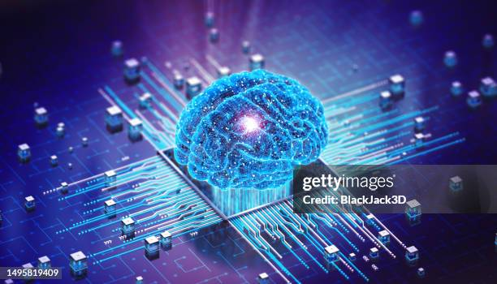

`#RRGGBB`

# *Influencia de las IAs en el Aprendizaje Humano*

## Desarrollos recientes en Inteligencia Artificial (IA)

### La IA ha avanzado notablemente gracias a tres factores clave: el desarrollo de procesadores gráficos especializados, la disponibilidad masiva de datos y los entornos de programación de código abierto para el aprendizaje automático.

> La inteligencia artificial ofrece enormes oportunidades para transformar la educación, mejorando el aprendizaje y adaptándose a las necesidades individuales de los estudiantes.

:smile:

[Fuente](https://megaprofe.es/impacto-de-la-inteligencia-artificial-en-el-aprendizaje/?)